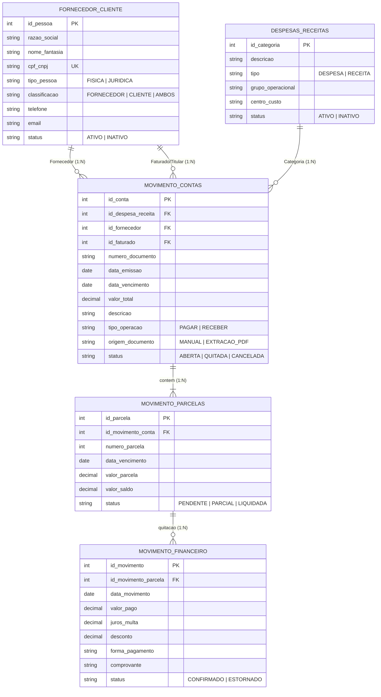

# AGENTS.md — Diretrizes de Engenharia e Regras de Operação

> **DOCUMENTO MANDATÓRIO DE ALINHAMENTO PARA AGENTES DE INTELIGÊNCIA ARTIFICIAL E DESENVOLVEDORES**  
> Este repositório é desenvolvido de forma colaborativa por múltiplos desenvolvedores e assistentes de IA (Antigravity, Cursor, Windsurf, GitHub Copilot, Claude, ChatGPT, etc.).  
> **Todas as IAs que operarem neste projeto DEVEM ler e seguir rigorosamente as diretrizes e regras estipuladas neste arquivo.**

---

## 1. Proposta do Projeto

O **AgroContas** é um sistema de **Gestão Financeira Rural** concebido para produtores rurais familiares e gestores do agronegócio, integrando controles financeiros tradicionais a um motor inteligente de ingestão de documentos fiscais.

* **Contexto Institucional**: Projeto desenvolvido no âmbito da disciplina de **Desenvolvimento Orientado a Objetos (DOO)** da **Universidade de Rio Verde (UniRV)** pela **Equipe de Desenvolvimento AgroContas**.
* **Diferencial Tecnológico**: Automação da captura de dados cadastrais, financeiros e tributários a partir de Notas Fiscais Eletrônicas (NF-e/DANFE) em formato PDF via Inteligência Artificial (**Google Gemini 3.6 Flash**), com conciliação automática em contas a pagar/receber e controle de parcelamentos.

---

## 2. Regra de Ouro: Conformidade com a Documentação Oficial

> ⚠️ **MANDATO IMPERATIVO**: Toda e qualquer alteração de código, criação de tabelas, endpoints ou telas **DEVE SEGUIR À RISCA** a documentação oficial da disciplina.
>
> 📖 **Fonte da Verdade**:
> 1. Resumo textual rápido para LLMs: [`docs/DOCUMENTACAO_REQUISITOS_RESUMO.txt`](docs/DOCUMENTACAO_REQUISITOS_RESUMO.txt)
> 2. Documentação oficial completa em PDF: [`docs/corrigida/AgroContas_Documentacao_Requisitos_v1.0.pdf`](docs/corrigida/AgroContas_Documentacao_Requisitos_v1.0.pdf)
> 3. Código-fonte LaTeX: [`docs/corrigida/AgroContas_Documentacao_Requisitos_v1.0.tex`](docs/corrigida/AgroContas_Documentacao_Requisitos_v1.0.tex)
> 4. Histórico da avaliação do professor: [`docs/original/Avaliacao_Professor.pdf`](docs/original/Avaliacao_Professor.pdf)

Nenhum agente deve inventar entidades fora do escopo homologado ou alterar a nomenclatura das entidades padronizadas sem consentimento explícito dos autores.

---

## 3. Os 7 Requisitos Funcionais Canônicos

O sistema é delimitado exclusivamente pelas **7 funções canônicas** exigidas na avaliação de DOO:

| ID | Nome da Funcionalidade | Responsabilidade |
| :--- | :--- | :--- |
| **RF01** | **Manter Fornecedor / Cliente** | CRUD completo de parceiros comerciais (fornecedores de insumos/serviços e clientes/titulares da safra). |
| **RF02** | **Manter Despesas / Receitas** | CRUD do plano de contas rural (categorias operacionais, centros de custo, grupos de despesas e receitas). |
| **RF03** | **Manter MovimentoContas** | Gerenciamento dos títulos mestre de Contas a Pagar e Contas a Receber, associando Fornecedor, Faturado e Despesa. |
| **RF04** | **Manter MovimentoParcelas** | Desdobramento das contas em parcelas a prazo, datas de vencimento, valores e controle de saldo residual. |
| **RF05** | **Manter MovimentoFinanceiro (Quitação)** | Registro de baixas, pagamentos e liquidações de parcelas, juros/multas, descontos e comprovantes. |
| **RF06** | **Fazer Upload do Documento** | Interface para carregamento de arquivos PDF (faturas, DANFEs, notas fiscais). |
| **RF07** | **Extrair Dados do Documento** | Processamento semântico do PDF via IA/Gemini, retornando dados estruturados para conferência e gravação. |

---

## 4. Modelo de Dados Relacional (DER) — 5 Entidades Obrigatórias

O banco de dados do sistema deve implementar estritamente as seguintes 5 tabelas e seus relacionamentos de chave estrangeira:



---

## 5. Padrão de Interface de Usuário (Regra dos Casos "MANTER")

> 📌 **REGRA MANDATÓRIA DE INTERFACE DA DISCIPLINA**:  
> Para todas as operações do tipo **"MANTER" (RF01, RF02, RF03, RF04, RF05)**:
> 1. **A PRIMEIRA TELA DEVE SER SEMPRE UMA LISTAGEM / DATAGRID DE CONSULTA.**
> 2. A tela de listagem deve conter:
>    * Filtros de pesquisa no cabeçalho;
>    * Tabela/DataGrid com os registros cadastrados;
>    * Botões de ação padronizados: **"Consultar"**, **"Incluir Novo"**, **"Alterar Selecionado"**, **"Desativar / Reativar"**.
> 3. Formulários de inclusão/edição devem abrir em página dedicada ou modal, e ao salvar devem redirecionar de volta para a listagem com os dados atualizados.

---

## 6. Arquitetura do Repositório e Divisão de Arquivos

O projeto é estruturado em monorepo com separação estrita de responsabilidades:

```text
agrocontas/
├── docs/                                 # Documentação de Engenharia de Requisitos
│   ├── DOCUMENTACAO_REQUISITOS_RESUMO.txt # Resumo direto em texto para leitura rápida de LLMs
│   ├── original/                         # Histórico: versão original v1.01 e avaliação do professor
│   ├── corrigida/                        # Versão oficial homologada v1.0 (PDF, LaTeX e diagramas)
│   └── README.md                         # Guia e matriz comparativa da documentação
│
├── agrocontas/
│   ├── backend/                          # API RESTful (Node.js + Express + TypeScript)
│   │   ├── src/
│   │   │   ├── config/                   # Configurações de ambiente (env, multer)
│   │   │   ├── controllers/              # Controladores HTTP (validação de entrada/resposta)
│   │   │   ├── routes/                   # Definição e roteamento dos endpoints da API
│   │   │   ├── schemas/                  # Schemas de validação e esquemas estruturados Gemini
│   │   │   ├── services/                 # Regras de negócio, IA (GeminiService) e banco de dados
│   │   │   ├── types/                    # Tipagens e interfaces TypeScript
│   │   │   ├── app.ts                    # Configuração da aplicação Express e middlewares
│   │   │   └── server.ts                 # Ponto de entrada do servidor HTTP (porta 3000)
│   │   ├── .env.example                  # Template de variáveis de ambiente
│   │   ├── package.json
│   │   └── tsconfig.json
│   │
│   └── frontend/                         # SPA Web (Vue 3 + TypeScript + Vite)
│       ├── src/
│       │   ├── components/               # Componentes Vue reutilizáveis
│       │   │   ├── FileUpload.vue        # Componente de Drag & Drop para PDF (RF06)
│       │   │   ├── FormattedViewer.vue   # Visualização formatada da NF extraída (RF07)
│       │   │   ├── JsonViewer.vue        # Visualizador de JSON bruto extraído
│       │   │   └── SettingsTab.vue       # Configuração de chave de API e modelos
│       │   ├── services/                 # Clientes HTTP (Axios / Fetch) e comunicação com a API
│       │   ├── types/                    # Tipos e interfaces compartilhadas do frontend
│       │   ├── App.vue                   # Componente raiz da aplicação
│       │   ├── main.ts                   # Ponto de entrada do Vue
│       │   └── style.css                 # Estilos globais e tokens de design
│       ├── index.html
│       ├── package.json
│       └── vite.config.ts
│
├── AGENTS.md                             # Este arquivo (guia unificado para IAs)
└── README.md                             # Apresentação do projeto e instruções de execução
```

---

## 7. Boas Práticas de Código e Desenvolvimento

### Backend (Node.js + TypeScript)
1. **Clean Architecture / Camadas**:
   * `Routes` apenas declaram rotas e middlewares.
   * `Controllers` recebem requisição, validam parâmetros e devolvem status HTTP (`200`, `201`, `400`, `404`, `500`).
   * `Services` contêm regras de negócio e chamadas externas (ex.: Gemini, banco de dados).
2. **Tipagem Estrita**: É terminantemente proibido o uso genérico de `any` sem justificativa. Defina interfaces em `types/`.
3. **Tratamento de Erros**: Toda chamada assíncrona deve utilizar `try/catch` com respostas estruturadas no padrão `{ success: boolean, data?: T, error?: string }`.
4. **Segurança de Credenciais**: NUNCA commitar chaves de API (`GEMINI_API_KEY`) ou arquivos `.env`. Utilize sempre o `.env.example`.

### Frontend (Vue 3 + TypeScript)
1. **Composition API**: Escrever todos os componentes no formato moderno `<script setup lang="ts">`.
2. **Reatividade Limpa**: Utilizar `ref()` e `computed()` de forma legível; evitar mutações de estado imprevisíveis.
3. **Acessibilidade e Usabilidade**:
   * Fornecer estados de carregamento (*spinners*) e mensagens de erro visíveis;
   * Manter botões com contrastes adequados e ícones descritivos;
   * Seguir a codificação cromática: verde para receita/sucesso, vermelho/laranja para despesa/pendência.

---

## 8. Protocolo de Colaboração Multi-IA e Git

Quando um agente de IA estiver trabalhando no projeto:
1. **Verificação Prévia**: Antes de editar um arquivo, leia seu conteúdo integral para não sobrescrever trabalho de outro desenvolvedor ou de outra IA.
2. **Preservação de Contexto**: Mantenha comentários explicativos em regras complexas de regex, schemas do Gemini e cálculos de amortização.
3. **Padrão de Commits**: Utilize Conventional Commits em inglês ou português:
   * `feat: adiciona CRUD de Fornecedor/Cliente`
   * `fix: corrige validacao de parcelas no schema`
   * `docs: atualiza documentacao de requisitos`
   * `refactor: desacopla servico de extracao`
4. **Testes Antes da Conclusão**: Certifique-se de que a compilação do TypeScript (`npm run build` ou `npx tsc`) passe com zero erros antes de entregar a tarefa.
